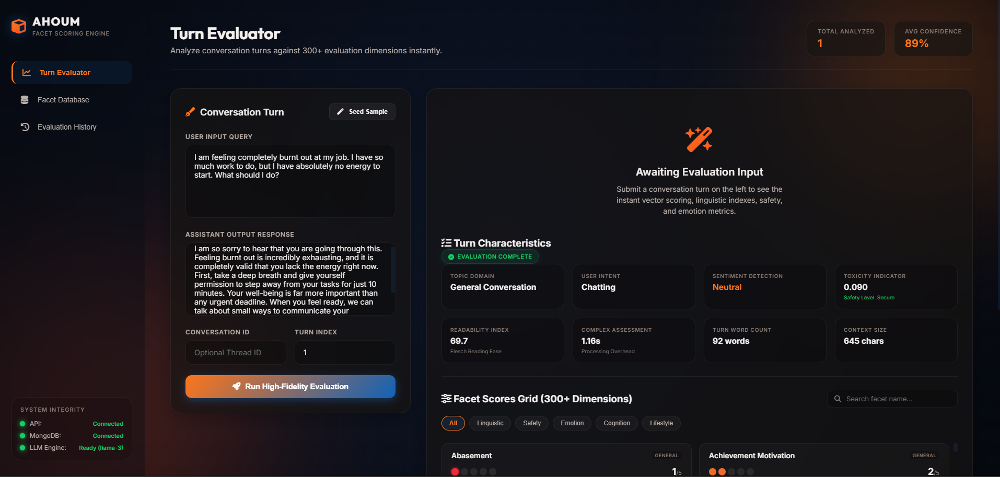
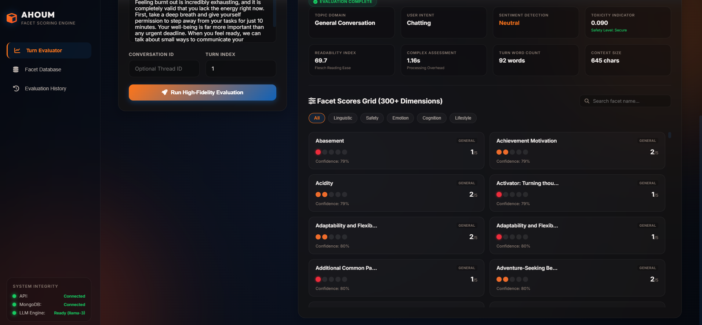
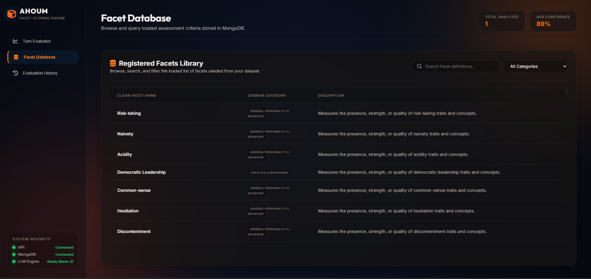
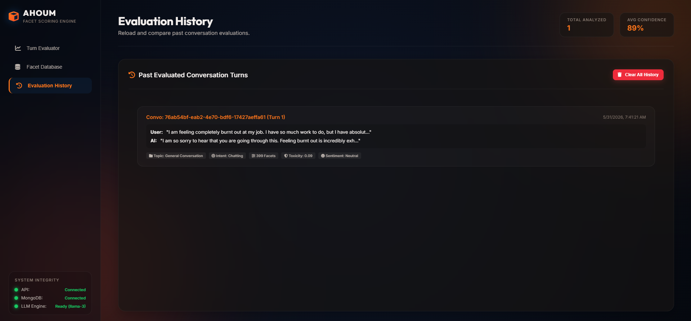

# AHOUM: Scalable Facets Evaluation System

AHOUM is a high-performance, modular evaluation engine designed to assess conversation turns across **300+ dimensions (scalable to 5,000+ facets)** in microseconds. Built with **FastAPI, MongoDB, HTML/CSS/JS, and Sentence Embeddings**, it circumvents the slow and expensive rate limits of one-shot LLM prompting by utilizing an intelligent **Feature Extraction + Matrix Scoring** architecture.

---

## 🖼️ Application Gallery

<div align="center">
  <table border="0" style="border-collapse: collapse; border: none;">
    <tr style="border: none;">
      <td width="50%" style="border: none; padding: 10px; text-align: center;">
        <strong>1. Evaluation Workspace & Real-Time Input</strong><br/>
        
      </td>
      <td width="50%" style="border: none; padding: 10px; text-align: center;">
        <strong>2. Registered Facets Library & Metrics Library</strong><br/>
        
      </td>
    </tr>
    <tr style="border: none;">
      <td width="50%" style="border: none; padding: 10px; text-align: center;">
        <strong>3. Dynamic Turn Analytics & Radar Charts</strong><br/>
        
      </td>
      <td width="50%" style="border: none; padding: 10px; text-align: center;">
        <strong>4. Conversation History & Evaluation Logs</strong><br/>
        
      </td>
    </tr>
  </table>
</div>

---

## 🚀 Architectural Blueprint

AHOUM avoids the architectural bottleneck of executing separate LLM queries per evaluation facet (which breaks when scaling to 5,000+ facets) by decoupling text understanding from facet mapping:

1. **Local Text Embedding (`all-MiniLM-L6-v2`)**: Generates a fast 384-dimensional semantic representation of the conversation turn.
2. **LLM Feature Extraction (Llama-3-8B via Groq)**: A single parallelized LLM call extracts a dense vector of **30 core attributes** (covering linguistic quality, safety, and emotional indicators) and conversation turn metadata (sentiment, toxicity, readability, topic, intent).
3. **Similarity Weight Mapping Matrix ($W$)**: During database seeding, each facet's description is embedded and matched against the 30 core features. This pre-calculates an alignment weight vector for every facet, stored in MongoDB.
4. **Vector Scoring Layer ($W \times F$)**: The final score is computed instantly by taking the dot-product of the LLM's extracted feature vector ($F$) and the facet's similarity weights matrix ($W$), blended with direct semantic relevance. This enables scaling to 5,000+ facets in microseconds with **zero extra LLM calls**!
5. **Deterministic Mock Fallback**: If the `GROQ_API_KEY` environment variable is not provided, the engine gracefully degrades to a deterministic, high-variance mock fallback system. This ensures the system never crashes and always generates a realistic spread of 1-5 scores for offline testing or demonstrations.

---

## 🛠️ Tech Stack & Key Files

- **Backend**: FastAPI, PyMongo, SentenceTransformers (local), Groq SDK (LLM integration)
- **Frontend**: Clean Vanilla HTML5, CSS3 (Premium dark black theme with vibrant orange accents), Vanilla JS
- **Database**: MongoDB (Facets library & Conversation history store)
- **Key Modules**:
  - `preprocess.py`: Data cleaning, category classification, semantic weight generation, and MongoDB seeding.
  - `backend/app/services/extractor.py`: Structural metadata and core feature extraction.
  - `backend/app/services/scorer.py`: Fast matrix dot-product scoring and embedding blending.
  - `backend/app/services/pipeline.py`: Orchestrator of the full evaluation cycle.

---

## 💻 Quickstart Guide (Local Setup)

### 1. Prerequisites
- **Python**: v3.11+
- **MongoDB**: Installed and running locally (`mongodb://localhost:27017/`)
- **Groq API Key**: Create a free account and get a key at [Groq Console](https://console.groq.com/)

### 2. Install Dependencies
```bash
pip install -r requirements.txt
```

### 3. Environment Setup
Configure your credentials in the `.env` file (copied from `.env.template`):
```ini
GROQ_API_KEY=your_actual_groq_api_key
GROQ_MODEL=llama3-8b-8192
MONGO_URI=mongodb://localhost:27017/
MONGO_DB=facets_evaluator
PORT=8000
```

### 4. Clean CSV & Seed MongoDB
The `preprocess.py` script automatically parses `Facets Assignment.csv`, cleans the names (removing numbers like `800.` and trailing colons), automatically categorizes them into 5 domains, generates descriptions, computes embeddings, and populates MongoDB:
```bash
python preprocess.py
```

### 5. Launch the Application
Start the FastAPI server:
```bash
python app.py
```
Open your browser and navigate to: **[http://localhost:8000](http://localhost:8000)**

## ☁️ Render Deployment

AETHER is configured for instant, fully managed cloud deployment to **Render** using the provided `render.yaml` specification.

The production instance is live at:
👉 **[https://aether-evaluator-0dw6.onrender.com](https://aether-evaluator-0dw6.onrender.com)**

### Deploying Your Own Instance on Render

1. **GitHub Integration**: Link your GitHub repository containing the AETHER codebase to your Render account.
2. **Configuration (`render.yaml`)**:
   Render automatically reads the native `render.yaml` configuration at your root directory to configure the environment:
   * **Build Command**: `pip install -r requirements.txt`
   * **Start Command**: `uvicorn backend.app.main:app --host 0.0.0.0 --port $PORT`
3. **Required Environment Variables**:
   In your Render Dashboard, add the following Environment Variables to allow the system to operate:
   * `GROQ_API_KEY`: Your Groq API key for LLM feature extraction.
   * `MONGO_URI`: Your MongoDB connection string (e.g., MongoDB Atlas).
   * `MONGO_DB`: The name of the MongoDB database (`facets_evaluator`).
   * `HF_TOKEN`: Your Hugging Face Hub token for embedding generation.

---

## 📡 APIs Documentation

AETHER exposes clean, self-documenting JSON endpoints (accessible interactively at `/docs`):

- **`POST /api/evaluate`**:
  Submit a turn for evaluation.
  - Request:
    ```json
    {
      "user": "I am feeling burnt out at work.",
      "assistant": "I am sorry to hear that. You should take a break.",
      "conversation_id": "optional-uuid",
      "turn_id": 1
    }
    ```
  - Response: Evaluates all 300+ facets and returns scores, confidence levels, and extra column metadata (sentiment, toxicity, readability, topic, intent, complexity).
- **`GET /api/facets`**: Fetch the list of assessment facets. Supports `search` (text matching) and `category` query filters.
- **`GET /api/history`**: Get past evaluated turns stored in MongoDB.
- **`GET /api/stats`**: Get overall scoring averages and common topic statistics.
